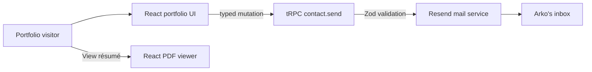
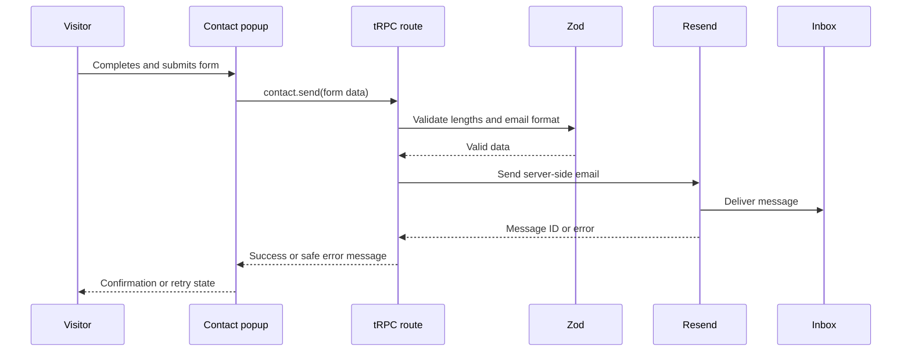

# Arko Kundu — Tactile Terminal Portfolio

> **A dark, editorial portfolio for a software developer who builds composed, useful digital products.**

[](https://react.dev/)
[](https://www.typescriptlang.org/)
[](https://tailwindcss.com/)
[](https://trpc.io/)
[](https://resend.com/)

## Overview

This repository contains **Arko Kundu’s Tactile Terminal portfolio**: a responsive portfolio experience that treats software work as a carefully indexed archive. The interface pairs editorial typography with a midnight navy-black palette, system-record overlays, a draggable hero artifact, project records, a browser-rendered résumé preview, and a secure contact composer.

The project is deliberately more than a static landing page. It uses a React client and a small TypeScript server to deliver a typed contact form workflow. The browser submits only visitor-provided form data; the server validates that data and delivers it with Resend, keeping the API credential private.

> “I build lucid interfaces for complicated ideas—where product logic, code, and detail move in the same direction.”

## Experience Map

| Section | Visitor outcome | Signature interaction |
| --- | --- | --- |
| Hero | Establishes Arko’s point of view and availability. | A bounded, draggable violet orbit note. |
| Selected Work | Presents three product-system case studies. | Archive labels, active record treatment, and project detail toggles. |
| Achievements | Explains the engineering principles behind the work. | Evidence-record timeline. |
| Approach | Communicates the development philosophy. | In-browser PDF résumé preview. |
| Contact | Lets a visitor write directly from the portfolio. | Accessible modal with pending, error, and success states. |

## Design System

The visual direction is called **Tactile Terminal**. It combines digital brutalism with Japanese editorial restraint: generous negative space, oversized Space Grotesk display type, DM Mono labels, black and navy planes, and a single active signal—**Orbit Violet** (`#A78BFA`). The split-orbital monogram repeats in the rail, hero metadata, and footer to make the identity legible beyond the name.



## Technology Stack

| Layer | Technology | Why it is here |
| --- | --- | --- |
| UI | React 19 + TypeScript | Component-driven user interface with static checking. React components combine markup, logic, and state within reusable units.[1] |
| Styling | Tailwind CSS 4 + custom CSS | Fast utility styling plus project-specific visual rules. Tailwind scans templates for class names and emits the matching static CSS.[2] |
| Motion | GSAP + Draggable | Hero entrance motion and the tangible drag interaction. GSAP’s Draggable plugin supports mouse and touch dragging with configurable bounds.[3] |
| State | Zustand + Immer | Small global store for portfolio interactions, with immutable updates. Zustand exposes a hook-based store API.[4] |
| Time | dayjs | Drives the live status timestamp in the desktop rail. |
| Tooltips | React Tooltip | Adds accessible hover explanation to non-obvious controls. |
| Résumé | `@react-pdf/renderer` | Renders a résumé document directly inside the browser. React-pdf provides web rendering through `PDFViewer`.[5] |
| API | Express + tRPC + Zod | Type-safe client/server contract and server-side validation. tRPC uses TypeScript inference to keep client and server contracts aligned.[6] |
| Email | Resend | Server-side delivery of contact messages using a configured sender and recipient. |
| Testing | Vitest | Verifies login behavior, mail payload construction, and the configured Resend credential. |

## Repository Map

```text
.
├── client/
│   └── src/
│       ├── pages/Home.tsx           # Portfolio UI, interactions, modal states
│       ├── index.css                # Tactile Terminal tokens and responsive rules
│       ├── App.tsx                  # Application shell and dark theme
│       └── lib/trpc.ts              # Typed client binding
├── server/
│   ├── routers.ts                   # tRPC routes, including contact.send
│   ├── contactEmail.ts              # Resend email composition and delivery
│   ├── contactEmail.test.ts         # Mail payload unit test
│   └── resend.credentials.test.ts   # Lightweight credential verification
├── drizzle/                          # Database schema and migrations from the full-stack template
├── CONTACT_EMAIL_SETUP.md           # Contact-email configuration reference
├── learn.txt                         # Beginner-friendly project walkthrough
└── package.json                      # Scripts and dependencies
```

## Quick Start

### Prerequisites

Install **Node.js 22+** and **pnpm**. The project’s package manager version is pinned in `package.json`, so use pnpm rather than npm or Yarn for consistent lockfile behavior.

### Installation

```bash
git clone <your-repository-url>
cd arko-kundu-portfolio
pnpm install
```

### Local Development

```bash
pnpm dev
```

The full-stack development command runs the TypeScript server, which also serves the Vite-powered client. Open the local address printed by the command.

### Quality Checks

| Command | Purpose |
| --- | --- |
| `pnpm check` | Runs TypeScript without emitting files. |
| `pnpm test` | Runs the Vitest suite. |
| `pnpm build` | Creates the production client and server bundles. |
| `pnpm format` | Applies the configured Prettier formatting. |

Run the following before opening a pull request:

```bash
pnpm check && pnpm test && pnpm build
```

## Contact Email Configuration

The contact composer is intentionally a **server-side integration**. Never put the Resend key in a `VITE_` environment variable or any client file. Vite exposes client-prefixed variables to browser code; secrets must remain server-only.

| Variable | Purpose | Example format |
| --- | --- | --- |
| `RESEND_API_KEY` | Authenticates the server to Resend. | `re_...` |
| `RESEND_FROM_EMAIL` | Verified sender identity. | `Arko Kundu <hello@yourdomain.com>` |
| `CONTACT_TO_EMAIL` | Inbox receiving submissions. | `hello@yourdomain.com` |

The server reads these values in `server/contactEmail.ts`. When a visitor submits the popup, the `contact.send` procedure validates the payload with Zod and invokes `sendContactMessage`. The visitor’s address becomes the email’s **reply-to** value, not the sender identity.

> **Important:** The sender domain in `RESEND_FROM_EMAIL` must be verified in the Resend account. Store all credentials in the hosting platform’s secret manager, never in a committed `.env` file.

## Contact Flow



## Testing Notes

The email layer has two intentional test levels. `server/contactEmail.test.ts` injects a mock mailer and verifies the generated recipient, reply-to address, subject, and message body without sending an email. `server/resend.credentials.test.ts` makes a lightweight authenticated request to Resend’s domains endpoint, confirming that the stored credential can authenticate. This separation avoids using a live email send as a routine test.

## Customization Guide

| If you want to change… | Start here | Considerations |
| --- | --- | --- |
| Project titles, descriptions, technology tags | `client/src/pages/Home.tsx` → `projects` | Keep image alt text meaningful. |
| Hero language or availability | `client/src/pages/Home.tsx` | Preserve concise editorial copy for the existing hierarchy. |
| Color and typography system | `client/src/index.css` | Reuse semantic tokens and retain contrast. |
| Résumé content | `ResumeDocument` in `client/src/pages/Home.tsx` | Keep the rendered PDF aligned with the visible portfolio. |
| Contact form fields | `Home.tsx` and `server/routers.ts` | Update both UI and Zod schema together. |
| Contact email body | `server/contactEmail.ts` | Keep `replyTo` bound to the validated visitor email. |

## Accessibility and Interaction Notes

The contact composer is rendered as a modal dialog with `aria-modal`, a labeled heading, a clear close button, visible focus styles, native form constraints, and explicit error messaging. Motion uses opacity and transform-based transitions, while the stylesheet provides a reduced-motion fallback. These choices keep the portfolio expressive without making essential navigation depend on animation.

## Deployment

Create a production build with `pnpm build`. Before publishing, add the three Resend variables in your host’s secret settings and confirm the sender domain has been verified. After deployment, send one intentional real submission from the contact popup and confirm the recipient can reply directly to the visitor.

## Learning Resource

For a beginner-first explanation of the project, open **[`learn.txt`](./learn.txt)**. It explains the project in a practical order, highlights common mistakes, and ends with interview questions and model answers.

## References

[1] [React, “Quick Start.”](https://react.dev/learn)  
[2] [Tailwind CSS, “Get started with Tailwind CSS.”](https://tailwindcss.com/docs)  
[3] [GSAP, “Draggable documentation.”](https://gsap.com/docs/v3/Plugins/Draggable/)  
[4] [Zustand, “Introduction.”](https://zustand.docs.pmnd.rs/getting-started/introduction)  
[5] [React-pdf, “Quick start guide.”](https://react-pdf.org/)  
[6] [tRPC, “Introduction.”](https://trpc.io/docs)  
[7] [Zod, “Introduction.”](https://zod.dev/)  
[8] [Resend, “Introduction.”](https://resend.com/docs/introduction)
